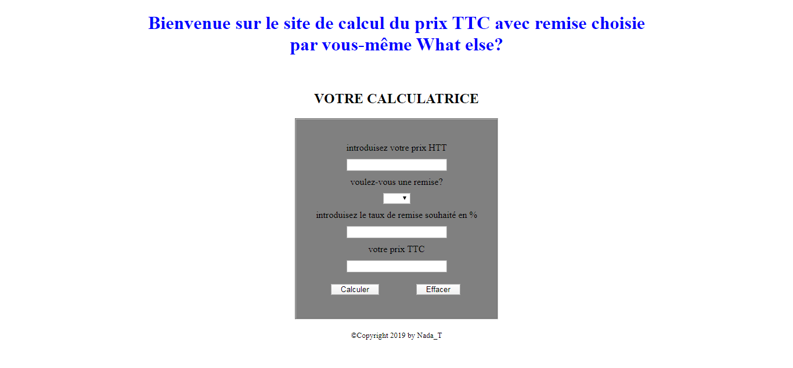

# Calculatrice de prix TTC avec ou sans remise choisie par l'utilisateur:

* Interface utilisateur: HTML/CSS
* Programme géré par Vanilla JS
* Paradigme de programmation:programmation procédurale
## objectifs:
* Manipulation des élements de DOM
* Manipulation des conditions(if/switch)
